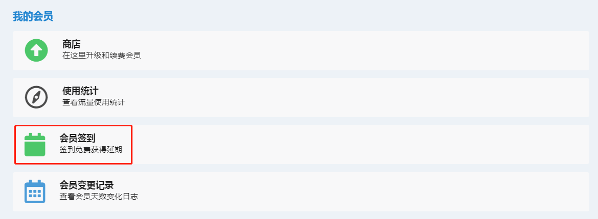
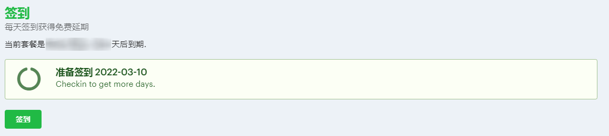
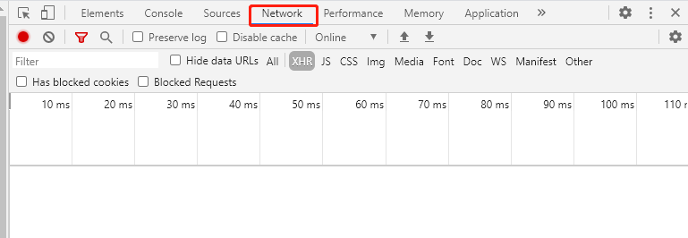
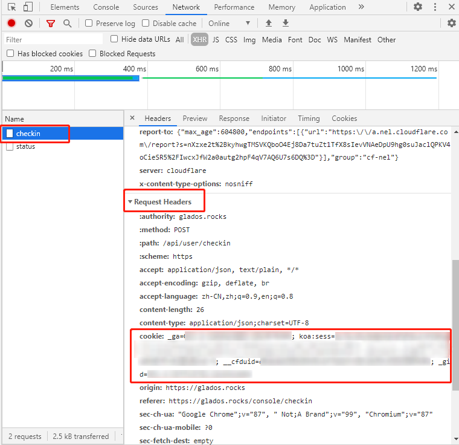
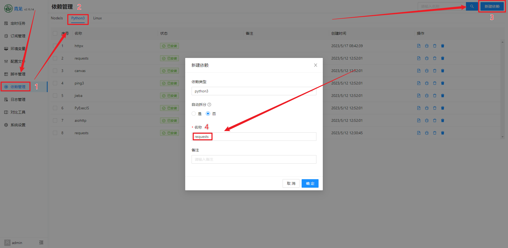
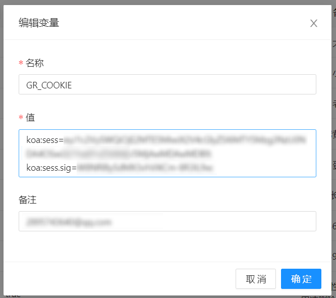
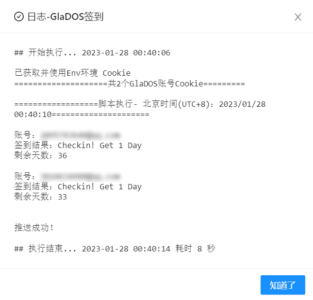

<div align="center">

# GLaDOS 自动签到⚡

_✨ 基于 [Python](https://www.python.org/) 实现的[GLaDOS](https://github.com/glados-network/GLaDOS)签到程序 ✨_  

</div>

<p align="center">
  <a href="https://github.com/hennessey-v/GlaDOS_Checkin_ql/blob/main/LICENSE">
    
  </a>
  <a href="https://www.python.org/">
    
  </a>
  <a href="https://github.com/hennessey-v/GlaDOS_Checkin_ql/">
    
  </a>
</p>

## 项目特点

- 基于 [Python](https://www.python.org/)语言
- 可自定义签到时间（基于crontab）
- 支持多账户
- 支持本地部署
- 支持部署在[青龙面板](https://github.com/whyour/qinglong)
- 支持多种通知推送方式
- [更新日志](#更新日志)

## 简单介绍一下GLaDOS

>GLaDOS是一家高速稳定的V2Ray/Trojan机场，超过4年的老品牌，官方网站使用自主开发的管理系统，属于技术派的老站，支持WireGuard协议加速，而且流量套餐性价比非常高。

GLaDOS家的优惠活动非常良心，新账号注册一段时间后基本都会赠送一次30天的基础套餐激活码，如果你的账户是教育版edu账户，甚至可以直接得到365天的基础套餐。不仅如此，每天签到也会获得一天当前套餐的续期，因此才有了本项目。

[GLaDOS 项目地址](https://github.com/glados-network/GLaDOS)

## 开始使用

### 准备工作
<details>
<summary>账号的 cookie（并非仅此单一获取方式）</summary>

  1. 注册 [GLaDos](https://glados.rocks/) 并登陆。  
  （注册时可选填邀请码，双方都将获得微量的额外天数奖励。这一步并不重要，但我期待并感谢大家的支持）
   ```
   38JNV-P6O0T-XXC1F-CC3OI
   ```

  2. 在首页往下拉，找到 **我的会员 > 会员签到**

     

  3. 点击跳转到签到页面

     

  4. 打开 "开发者工具"，通常快捷键为 **F12**，或是点击 **浏览器选项 > 更多工具 > 开发者工具**，打开后如图所示点击 "**network**" 标签

     

  5. 在签到页面点击签到，相对应的开发者工具 **network** 标签下会出现 "**checkin**" 请求，点击该请求，会出现更多信息，找到 "**Request Headers**" 里的 "**cookie**"，接下来设置密钥时需要用到

     
</details>

### qinglong 部署 (推荐)

<details>
<summary>一、安装依赖</summary>

  - 打开青龙面板，依赖管理页面。切换到Python3模块，点击新建依赖，导入并安装依赖
  ```
  requests
  ```

  

</details>

<details>
<summary>二、在青龙面板中设置环境变量</summary>

- 名称填入 **GR_COOKIE**， 值填入准备工作中账户的COOKIE。注：COOKIE需按 **'koa:sess=xxxxxxxxx; koa:sess.sig=xxxx;'** 的格式填入
- 多账号多次添加变量



</details>

<details>
<summary>三、在青龙中拉取本仓库</summary>

- 国内环境拉取指令（带代理）
```
ql repo https://ghproxy.com/https://github.com/hennessey-v/GlaDOS_Checkin_ql.git "checkin.py" "backUp|assets|README.md" "sendNotify.py"
```
- 国外环境拉取指令
```
ql repo https://github.com/hennessey-v/GlaDOS_Checkin_ql.git "checkin.py" "backUp|assets|README.md" "sendNotify.py"
```
</details>

<details>
<summary>四、运行脚本查看运行结果</summary>



</details>

### 本机部署

<details>
<summary>一、拉取仓库到本地</summary>

- 国内环境拉取指令（带代理）
```
git clone https://ghproxy.com/https://github.com/hennessey-v/GlaDOS_Checkin_ql.git GlaDOS_Checkin
```
- 国外环境拉取指令
```
git clone https://github.com/hennessey-v/GlaDOS_Checkin_ql.git GlaDOS_Checkin
```
</details>

<details>
<summary>二、安装依赖</summary>

  - 进入项目目录输入以下命令
  - 国内环境
  ```
  pip install -r requirements.txt -i https://pypi.tuna.tsinghua.edu.cn/simple
  ```
  - 国外环境
  ```
  pip install -r requirements.txt
  ```
</details>

<details>
<summary>三、配置cookie</summary>

- 进入 GlaDOS_Checkin 文件夹，将cookie按照 **'koa:sess=xxxxxxxxx; koa:sess.sig=xxxx;'** 的格式填入 **config.py** ，多账号用 "," 分割
 
</details>
<details>
<summary>四、运行脚本</summary>

- 在GlaDOS_Checkin目录下，运行脚本
```
python checkin.py
```

- linux可配和[crontab](https://www.runoob.com/linux/linux-comm-crontab.html)实现定时签到，windows可使用[go-crontab](https://github.com/hezhizheng/go-crontab/releases)来实现。具体用法请自行探索

</details>


## 更新日志
<details>
<summary>更新日志</summary>

### [1.2.3] - 2023-7.26
#### 变更
- 文档增加安装依赖步骤

### [1.2.2] - 2023-7.21
#### 新增
- 新增飞书等多种通知方式

### [1.2.1] - 2023-5-7
#### 新增
- 新增本地部署
- 新增运行失败提示
#### 变更
- 优化运行中信息显示效果
- 完善文档

### [1.2.0] - 2023-03-22
#### 变更
- 优化逻辑，增强运行稳定性。
- 修复了空Cookie导致的报错。
- 完善注释，增强可读性。

### [1.1.2] - 2023-02-17
#### 变更
- 修复企业微信应用文本方式推送错误（感谢[肥牛（sailcom）](https://github.com/sailcom)）
- 文档小变化

### [1.1.1] - 2023-01-31
#### 新增
- 添加了国内环境下的拉取指令
- 新增问题模板

### [1.1.0] - 2023-01-29
#### 变更
- 修复拉取脚本无法自动添加任务的问题
- 文档更新

### [1.0.0] - 2023-01-12
项目发布
#### 变更
- 兼容多账户，推送信息增加账户邮箱信息提示
#### 新增
- 多账号签到
- 多种推送渠道
  - Bark服务
  - TGBot推送
  - QQ机器人
  - 企业微信应用
  - 企业微信BOT
  - 微信推送Plus+

</details>

## 鸣谢
- 部分程序代码来源于开源项目[glados_checkin](https://github.com/akinlau/glados_checkin)，部分图片素材来自于[DullSword](https://github.com/DullSword)大佬
- 问题模板灵感来自于开源项目[lx-music-desktop](https://github.com/lyswhut/lx-music-desktop)


## Star⭐

**如果你觉得这个项目还不错的话，可以支持一下点个 Star⭐.**
